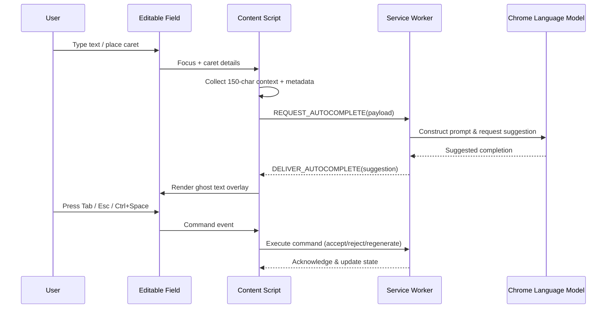
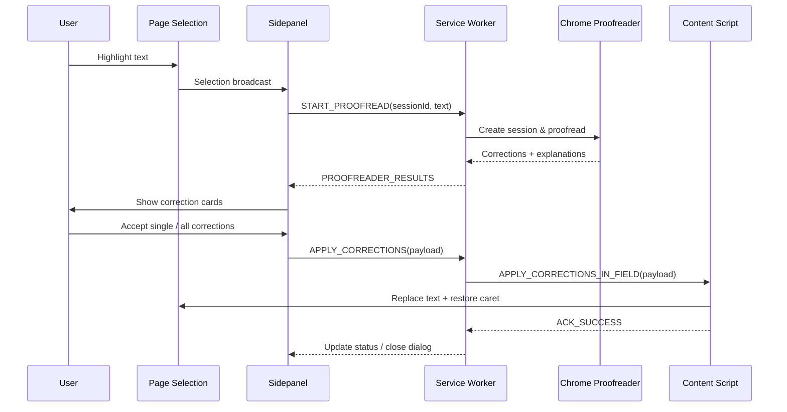
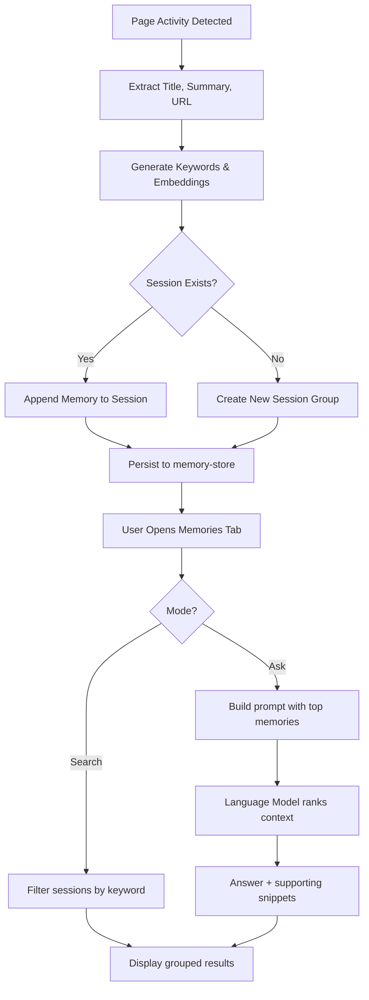
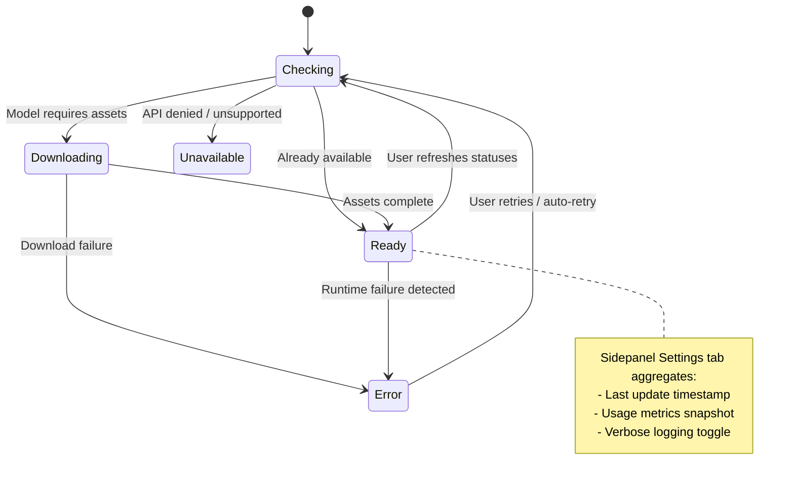

<!-- markdownlint-disable -->

# NanoScribe AI – Intelligent On-Device Writing Companion


NanoScribe AI is a Manifest V3 Chrome extension that pairs the latest on-device Chrome Prompt APIs with a rich semantic memory system. It helps you draft faster, polish prose, recall past research, and keep everything private on your machine. This README captures the full feature set, how the extension works, and everything you need to build, customize, and ship it.

## Table of contents

- [Overview](#overview)
- [Feature highlights](#feature-highlights)
  - [Context-aware autocomplete](#context-aware-autocomplete)
  - [Proofreader & correction workflow](#proofreader--correction-workflow)
  - [Semantic memory & recall](#semantic-memory--recall)
  - [Diagnostics & model monitoring](#diagnostics--model-monitoring)
  - [Privacy & offline-first design](#privacy--offline-first-design)
- [Architecture](#architecture)
  - [Extension surfaces](#extension-surfaces)
  - [Core background modules](#core-background-modules)
- [Installation & setup](#installation--setup)
  - [Quick start](#quick-start)
  - [Development workflow](#development-workflow)
  - [Loading the extension in Chrome](#loading-the-extension-in-chrome)
- [Using NanoScribe](#using-nanoscribe)
  - [First run experience](#first-run-experience)
  - [Autocomplete workflow](#autocomplete-workflow)
  - [Proofreader workflow](#proofreader-workflow)
  - [Working with memories](#working-with-memories)
  - [Settings & diagnostics tab](#settings--diagnostics-tab)
  - [Keyboard shortcuts](#keyboard-shortcuts)
- [Semantic memory & context pipeline](#semantic-memory--context-pipeline)
- [Diagnostics & troubleshooting](#diagnostics--troubleshooting)
- [Development notes](#development-notes)
  - [Project structure](#project-structure)
  - [Scripts](#scripts)
  - [Environment variables](#environment-variables)
- [Status & roadmap](#status--roadmap)
- [Contributing](#contributing)
- [License](#license)

## Overview

NanoScribe runs entirely in the browser and leans on Chrome’s on-device LanguageModel and Proofreader APIs. Context from your current document, recent browsing sessions, and saved memories is blended into prompts to generate helpful, privacy-preserving assistance. No cloud inference, no external servers, no data exfiltration.

## Feature highlights

### Context-aware autocomplete

- **Live ghost suggestions**: The content script renders an in-field ghost text overlay showing the suggestion exactly where it will be inserted.
- **150-character context window**: For each request we capture up to 150 characters before and after the caret, giving the model meaningful leading and trailing context while avoiding duplication.
- **Adaptive prompting**: Prompts include field metadata (type, label, placeholder), prioritized session/memory snippets, and tailored guidance per field type (email, document, chat, search, code, generic).
- **Fast commands**: Accept suggestions with **Tab**, decline with **Esc**, or use the sidepanel buttons (Accept / Decline / Regenerate) for the active suggestion.
- **Duplicate & safety checks**: Responses are sanitized, truncated to the target word length, and dropped when they simply echo what is already after the cursor.
- **Context awareness toggle**: Users can disable semantic recall at any time; the system immediately falls back to local context only.



### Proofreader & correction workflow

- **Chrome Proofreader API integration**: We use the modern proofreader factory, availability checks, and download monitoring so the experience works even on fresh installs.
- **One-click bulk fixes**: “Accept All” applies every correction back into the originating field, preserving selection ranges and cursor positions.
- **Targeted fixes**: Tap any correction card to apply just that edit. Each card includes the correction type tag and an explanation when provided by the model.
- **Robust error states**: The UI surfaces loading, downloading, unavailable, and error states with actionable messaging (reload, retry, cancel session).
- **Works across frames**: Background messaging coordinates the sidepanel and content script to apply changes in the correct DOM context.



### Semantic memory & recall

- **Automatic memory capture**: Browsing activity is distilled into parsed memories with titles, key points, and metadata.
- **Session grouping**: Memories are clustered by browsing session so you can skim timelines and resume context quickly.
- **Ask NanoScribe**: Switch the memories tab into Q&A mode to ask free-form questions. Answers cite relevant memory snippets and offer quick links back to the source material.
- **Power tools**: Rename sessions, AI-organize unclassified memories, reprocess unorganized items, or bulk delete with confirmation guardrails.
- **Smart search**: Keyword filtering spans titles and summaries. Searching auto-expands results, while Ask mode leverages memory ranking via the language model.



### Diagnostics & model monitoring

- **Real-time model status**: The settings tab shows readiness for the Language Model, Proofreader, and Summarizer (download in progress, ready, unavailable, errors).
- **Command feedback**: Errors from autocomplete actions surface inline so you can recover quickly.
- **Metrics snapshot**: View aggregate completion counts, success rate, failure rate, and timeouts to track overall health.
- **Verbose logging toggle**: Enable additional diagnostics to trace background processing when debugging.



### Privacy & offline-first design

- **Local-only processing**: All prompts, completions, and memories live inside Chrome storage and in-memory state. There are zero network requests to third-party services.
- **On-device AI**: Both autocomplete and proofreading use Chrome’s native on-device models. After the initial download they work completely offline.
- **User-controlled storage**: You can clear unorganized memories, group them intentionally, or disable context awareness entirely.

## Architecture

NanoScribe follows a familiar Chrome extension topology, split into dedicated surfaces that communicate via structured messaging.

### Extension surfaces

- **Content script (`src/extension/content-script.tsx`)**
  - Detects focused fields, gathers context, renders ghost suggestions, and applies completions.
  - Hosts keyboard handlers (Tab/Esc/Ctrl+Space) and broadcasts state changes back to the sidepanel.

- **Sidepanel React app (`src/extension/sidepanel/`)**
  - Provides the main UI with tabs for Autocomplete, Memories, Proofreader, and Settings.
  - Surfaces model download states, diagnostics metrics, and a memory management dashboard with rename/organize tools.

- **Service worker (`src/extension/service-worker.ts`)**
  - Orchestrates LanguageModel prompts, Proofreader sessions, and semantic memory queries.
  - Routes commands between the sidepanel and content script, manages retries, and maintains debounce logic.

- **Browser action popup (`src/extension/extension-popup/` – optional depending on manifest)**
  - Offers a quick look at model readiness and shortcuts into the full sidepanel experience.

### Core background modules

- **`language-model.ts`** – handles prompt construction, session lifecycle, fallback suggestions, and parameter tuning per field type.
- **`proofreader.ts`** – wraps the Proofreader API, checks availability/download states, and normalizes correction payloads.
- **`memory-store.ts`** – persists memories, groups them into sessions, calculates keyword similarity, and supports AI-assisted organization.
- **`model-status.ts`** – normalizes availability signals into user-readable states and broadcasts updates to all interested clients.

## Installation & setup

### Quick start

```bash
git clone <YOUR_GIT_URL>
cd <YOUR_PROJECT_NAME>

# Install dependencies (Node.js 18+ recommended)
npm install

# Start the Vite dev server with hot reload
npm run dev
```

> Tip: we recommend installing Node via [nvm](https://github.com/nvm-sh/nvm#installing-and-updating) to match the tooling used in CI.

### Development workflow

- **Live reload**: `npm run dev` launches Vite with web-extension reloading; the sidepanel and UI reload automatically after file changes.
- **Type safety**: The project uses TypeScript everywhere, with shared types under `src/extension/types.ts`.
- **Styling**: Tailwind CSS powers layout and tokens; shadcn-ui components provide polished primitives.
- **Linting**: Run `npm run lint` to ensure code passes the shared ESLint configuration.

### Loading the extension in Chrome

1. Run `npm run dev` (or `npm run build` for a production-ready bundle).
2. Open `chrome://extensions` in Chrome 131+ (required for on-device Prompt APIs).
3. Enable **Developer mode** in the top-right corner.
4. Click **Load unpacked** and select the generated `dist` directory.
5. Pin the “NanoScribe” extension to access the sidepanel quickly.

For production packages, run `npm run build` and load the resulting `dist` folder the same way.

## Using NanoScribe

### First run experience

1. After loading the extension, the service worker checks availability for each on-device model.
2. Chrome may need to download the Language Model and Proofreader. Progress is displayed in the sidepanel and popup.
3. Once models are ready, the Autocomplete tab reports “Listening” when you focus an editable field.

### Autocomplete workflow

1. Focus any supported input, textarea, or contentEditable element.
2. The content script captures up to 150 characters before/after the caret, field metadata, and (optionally) recent memory highlights.
3. Press **Tab** to accept a suggestion, **Esc** to clear it, or use the sidepanel buttons (Accept / Decline / Regenerate) for the active suggestion.
4. Press **Ctrl + Space** to manually request a new suggestion if the system is idle.
5. Use the Autocomplete tab to review the current suggestion, inspect captured field context, and execute commands even when the suggestion is visible only in the page.

### Proofreader workflow

1. Select text within an editable field or any highlighted content region.
2. Open the sidepanel and switch to the **Proofreader** tab (or it opens automatically after selection, depending on Chrome’s sidepanel state).
3. NanoScribe sends the text to the Proofreader API, handling downloads and status updates as needed.
4. Review individual corrections (with type badges and explanations) or click **Accept All** to apply every change.
5. Use **Cancel** to dismiss the session or **Reload Page** when a fatal error requires a refresh.

### Working with memories

1. Switch the sidepanel to the **Memories** tab.
2. Use the search input to filter by keywords or toggle to **Ask** mode for natural-language questions.
3. In Ask mode, hit Enter or click **Ask** to get a contextual answer accompanied by the memories that informed it.
4. Rename sessions inline, collapse/expand individual memories, and copy or open source links.
5. For unorganized memories, use **AI Organize**, **Reprocess**, or **Delete** to tidy the backlog.

### Settings & diagnostics tab

- Toggle context-aware autocomplete on/off.
- Inspect model readiness, download progress, and last update times.
- Enable verbose logging or metrics tracking to support debugging.
- Manually refresh model statuses and diagnostics snapshots.

### Keyboard shortcuts

| Action | Shortcut |
| --- | --- |
| Accept autocomplete suggestion | **Tab** |
| Decline autocomplete suggestion | **Esc** |
| Force a new suggestion | **Ctrl + Space** |
| Open the sidepanel | Click the extension icon / keyboard shortcut assigned by Chrome |
| Apply proofreader correction | Click correction card / **Accept All** button |

## Semantic memory & context pipeline

1. **Capture** – The content script dispatches page snapshots to the background when noteworthy activity occurs.
2. **Enrich** – `memory-store.ts` extracts keywords, deduplicates tokens, and groups entries into sessions by URL/time.
3. **Organize** – Users (or the AI organizer) can move memories into labeled sessions, rename them, or delete stale ones.
4. **Recall** – Autocomplete requests pull top-ranked context entries and summaries; Ask mode builds richer prompts to answer questions.
5. **Apply** – The LanguageModel prompt integrates session highlights only when context awareness is active, ensuring full user control.

## Diagnostics & troubleshooting

- **Model unavailable**: If the sidepanel reports a model as unavailable, wait for Chrome to finish downloading it or restart the browser.
- **Extension context invalidated**: Chrome occasionally restarts the service worker; the app recovers automatically, but you can reload the page if autocomplete stalls.
- **No suggestions**: Ensure context awareness is enabled (if desired) and the caret is inside a supported field. Use the Autocomplete tab to confirm the system status.
- **Proofreader errors**: The sidepanel shows actionable messages. Clicking **Reload Page** often resolves DOM desynchronization issues.
- **Debug logs**: Enable verbose logging in Settings to mirror the diagnostic output you see in the console.

## Development notes

### Project structure

```bash
src/
  components/            # Reusable UI components (shadcn-style)
  extension/
    background/          # Service worker modules (language model, proofreader, memory store)
    content-script.tsx   # Field detection, ghost text, command routing
    service-worker.ts    # Entry point for background logic
    sidepanel/           # React sidepanel application
    messaging.ts         # Typed messaging helpers between contexts
  hooks/                 # Shared React hooks
  lib/                   # Utilities (logging, formatting, etc.)
```

### Scripts

- `npm run dev` – Start Vite with live reload for development.
- `npm run build` – Produce a production bundle in `dist/`.
- `npm run build:dev` – Build using development mode (useful for QA with unminified output).
- `npm run lint` – Run ESLint across the project.
- `npm run preview` – Serve the production build locally (for testing the sidepanel UI).

### Environment variables

- `NANOSCRIBE_ORIGIN_TRIAL_TOKEN` – Optional. Provide origin trial tokens (comma-separated) to unlock Chrome Prompt APIs on domains beyond `chrome://extensions`. The manifest configuration consumes this variable during build time.

## Status & roadmap

NanoScribe’s core feature set is complete and production-ready:

- Context-aware autocomplete with configurable context window
- Proofreader integration with bulk/individual corrections
- Semantic memory capture, search, organization, and Q&A
- Diagnostics dashboard and model lifecycle management

Future improvements can focus on richer analytics, import/export of memories, and language expansion, but the current release is fully functional.

## Contributing

Contributions are welcome! Please open an issue for major ideas before starting implementation.

1. Fork the repository.
2. Create a feature branch: `git checkout -b feature/amazing-feature`.
3. Commit with descriptive messages: `git commit -m "Add amazing feature"`.
4. Push the branch: `git push origin feature/amazing-feature`.
5. Open a Pull Request describing the change, testing steps, and screenshots where relevant.

## License

This project is licensed under the MIT License – see the [LICENSE](LICENSE) file for details.
